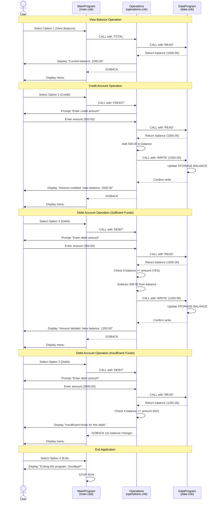

# COBOL Account Management System Documentation

## Overview

This system is a legacy COBOL-based account management application designed to manage student accounts. It provides basic banking operations including balance inquiries, credits (deposits), and debits (withdrawals).

## File Structure

### `main.cob` - Main Program Entry Point

**Purpose:** Acts as the primary user interface and application controller for the account management system.

**Key Functions:**
- Displays the main menu with four options:
  1. View Balance
  2. Credit Account (Deposit)
  3. Debit Account (Withdrawal)
  4. Exit
- Accepts user input and routes operations to the appropriate handler
- Maintains the application loop until the user chooses to exit
- Provides error handling for invalid menu choices

**Business Rules:**
- User must select a valid option (1-4) from the menu
- Invalid selections prompt an error message and redisplay the menu
- The program continues running until the user explicitly selects option 4 (Exit)

**Technical Details:**
- Program ID: `MainProgram`
- Uses CALL statement to invoke the `Operations` program
- Passes operation type as a parameter ('TOTAL ', 'CREDIT', or 'DEBIT ')

---

### `operations.cob` - Business Logic Layer

**Purpose:** Implements the core business logic for all account operations including balance inquiries, credits, and debits.

**Key Functions:**

1. **View Balance (TOTAL)**
   - Retrieves the current account balance from the data layer
   - Displays the balance to the user

2. **Credit Account (CREDIT)**
   - Prompts user to enter the credit amount
   - Retrieves current balance
   - Adds the credit amount to the balance
   - Updates the balance in the data layer
   - Displays the new balance

3. **Debit Account (DEBIT)**
   - Prompts user to enter the debit amount
   - Retrieves current balance
   - Validates that sufficient funds are available
   - If sufficient: subtracts the amount and updates the balance
   - If insufficient: displays an error message and does not process the transaction
   - Displays the result (new balance or error message)

**Business Rules:**
- **Insufficient Funds Protection:** Debit transactions are rejected if the withdrawal amount exceeds the current balance
- **Balance Persistence:** All balance changes are immediately persisted through the data layer
- **Transaction Integrity:** Each operation retrieves the current balance before modifying it to ensure accuracy
- **Initial Balance:** Accounts start with a default balance of $1,000.00

**Technical Details:**
- Program ID: `Operations`
- Uses CALL statement to invoke the `DataProgram` for data operations
- Handles decimal amounts up to 9999.99 with two decimal places
- Passes operation type ('READ' or 'WRITE') to the data layer

---

### `data.cob` - Data Access Layer

**Purpose:** Manages the persistent storage and retrieval of account balance data, acting as the data access layer for the application.

**Key Functions:**

1. **READ Operation**
   - Retrieves the stored balance value
   - Returns the balance to the calling program via the LINKAGE SECTION

2. **WRITE Operation**
   - Accepts a new balance value from the calling program
   - Updates the stored balance in memory

**Business Rules:**
- **Default Initial Balance:** New accounts are initialized with a balance of $1,000.00
- **Data Encapsulation:** All balance data is accessed exclusively through this module
- **Single Source of Truth:** The `STORAGE-BALANCE` variable maintains the authoritative account balance

**Technical Details:**
- Program ID: `DataProgram`
- Stores balance in `STORAGE-BALANCE` (PIC 9(6)V99) supporting values up to 999,999.99
- Uses LINKAGE SECTION to pass data between calling programs
- Currently implements in-memory storage (balance is lost when program terminates)

---

## System Architecture

```
┌─────────────────┐
│   main.cob      │  (User Interface Layer)
│   MainProgram   │
└────────┬────────┘
         │
         │ CALL 'Operations'
         │
         ▼
┌─────────────────┐
│ operations.cob  │  (Business Logic Layer)
│   Operations    │
└────────┬────────┘
         │
         │ CALL 'DataProgram'
         │
         ▼
┌─────────────────┐
│   data.cob      │  (Data Access Layer)
│  DataProgram    │
└─────────────────┘
```

## Business Rules Summary

### Student Account Management

1. **Initial Account Setup**
   - All student accounts start with an initial balance of $1,000.00
   - Balance is maintained in memory during program execution

2. **Credit Transactions**
   - **Maximum transaction amount:** $9,999.99 per transaction
   - **Maximum account balance:** $999,999.99
   - Credits are immediately reflected in the account balance
   - Credits that would cause the balance to exceed $999,999.99 are rejected

3. **Debit Transactions**
   - **Overdraft Protection:** Debits cannot exceed the current balance
   - Failed debit attempts (insufficient funds) do not modify the balance
   - Successful debits immediately reduce the account balance

4. **Balance Inquiries**
   - Balance can be viewed at any time
   - Balance reflects all previous transactions

5. **Transaction Limits**
   - Maximum transaction amount: $9,999.99
   - Maximum account balance: $999,999.99

## Data Specifications

- **Balance Format:** PIC 9(6)V99 (6 digits before decimal, 2 after)
- **Precision:** Two decimal places for currency values
- **Storage:** In-memory (non-persistent across program executions)

## Known Limitations

1. **No Data Persistence:** Balance data is stored in memory only and is lost when the program terminates
2. **Single Account:** System supports only one account at a time (no multi-user support)
3. **No Transaction History:** Past transactions are not logged or tracked
4. **No Authentication:** No user authentication or account identification
5. **No Input Validation:** Limited validation on user input amounts
6. **No Audit Trail:** No record of who performed which operations and when

## Future Modernization Considerations

When modernizing this legacy system, consider:
- Implementing persistent data storage (database)
- Adding multi-account support with unique identifiers
- Implementing user authentication and authorization
- Adding transaction logging and audit trails
- Enhancing input validation and error handling
- Adding support for different account types (checking, savings, etc.)
- Implementing transaction limits and daily withdrawal caps
- Adding reporting capabilities
- Implementing concurrent access controls

## Application Data Flow Sequence Diagram

The following Mermaid diagram illustrates the data flow and interactions between the three components of the system for different operations:



### Data Flow Summary

1. **User Interface Layer (main.cob)**: Captures user input and delegates to the appropriate business logic
2. **Business Logic Layer (operations.cob)**: Implements transaction logic, validates business rules, and coordinates data operations
3. **Data Access Layer (data.cob)**: Manages the in-memory balance storage with READ and WRITE operations

The diagram shows how each operation flows through the three-tier architecture, demonstrating the separation of concerns and modular design of the legacy system.
